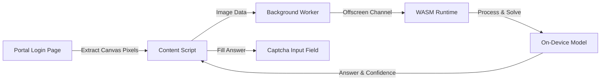

  
  <h1>AIUB Portal Captcha Auto-Solver</h1>
  
<strong>On-device neural network captcha solver for the AIUB Student Portal.</strong>

  <!-- Primary Store CTA Buttons -->
  

    
    &nbsp;&nbsp;
    
  

  <!-- Key Value Props -->
  

    
    
    
  

  <!-- Tech Stack -->
  

    
    
    
    
  

---

## Overview

### The Problem
Logging into the AIUB student portal requires students to solve a distorted arithmetic captcha (such as `76 - 42 = ?`) on every login attempt. For students checking schedules, grades, and attendance throughout the day, deciphering noisy numbers and doing manual math creates repetitive friction and unnecessary login delays.

### The Solution
**AIUB Captcha Auto-Solver** automates the math captcha directly inside the browser. It reads the captcha canvas, predicts the equation using an on-device neural network, and fills the solution into the answer field in milliseconds.

> [!NOTE]
> The extension only reads the captcha image and fills the math result. It **never** reads, stores, or transmits Student IDs or passwords.

### Features

- **On-Device Solving:** Extracts the captcha directly from the canvas element, evaluates the arithmetic equation, and fills the answer field.
- **Zero Credential Access:** The extension never inspects or logs user credentials. You type your ID and password yourself.
- **Automatic Reroll:** Automatically clicks refresh for an easier captcha if recognition confidence is low (up to 5 attempts).
- **Optional Auto-Submit:** An opt-in toggle to click Login once credentials are typed, protected by a rolling rate cap to avoid account lockouts.
- **Status Indicator:** On-page badge showing solving state, alongside a popup for settings.
- **No External Servers:** Completely offline operation with no telemetry, third-party analytics, or external API dependencies.

---

## User Guide: Using on [AIUB portal](https://portal.aiub.edu).

Once installed, the extension works automatically on the portal:

1. **Open the Portal:** Go to [portal.aiub.edu](https://portal.aiub.edu).
2. **Enter Student ID:** Type your Student ID into the username box and click outside (or press Tab). The portal will display the math captcha image.
3. **Automatic Solve:** The extension instantly reads the captcha, solves the arithmetic expression, and fills the answer into the box. An on-page status badge will indicate `Solved`.
4. **Log In:** Type your password and click **Log In**.
5. **Optional One-Click Login:** Click the extension icon in your browser toolbar to open the popup and enable **"Also click submit"**. When enabled, the extension will automatically click Log In after filling the captcha once both your ID and password fields are filled.

---

## Tech Stack & Architecture

| Component | Technology | Description |
|---|---|---|
| Extension Standard | Manifest V3 (MV3) | Supported across Chromium and Firefox |
| Execution Runtime | ONNX Runtime Web | WebAssembly SIMD execution provider |
| Image Processing | HTML5 Canvas Pipeline | Client-side pixel parsing and normalization |
| Chromium Worker | `chrome.offscreen` API | Isolated WebAssembly execution without blocking the main page |
| Firefox Worker | Background Event Scripts | Native background inference without requiring offscreen documents |

---

## How It Works

1. **Detection:** When the portal renders the captcha, the content script extracts the pixel data directly from the DOM image element.
2. **Preprocessing:** The image is normalized for local evaluation.
3. **Inference:** The on-device engine resolves the arithmetic expression inside the browser.
4. **Resolution:** The calculated solution is automatically typed into the captcha input box.
5. **Confidence Gating:** If the prediction confidence falls below 0.90, the extension clicks the refresh control for a new image instead of submitting an uncertain answer.

---

## Installation

### 1. Official Browser Stores (Recommended)

Install directly from your browser's official extension store for 1-click installation and automatic background updates:

  

    
    &nbsp;&nbsp;&nbsp;&nbsp;
    
  

  

    <a href="https://chrome.google.com/webstore/detail/iidomcjgemdcaipoghgndiiameienamc"><strong>Chrome Web Store</strong></a> (Chrome, Brave, Edge, Opera)
    &nbsp;•&nbsp;
    <a href="https://addons.mozilla.org/firefox/addon/aiub-captcha-auto-solver/"><strong>Firefox Add-ons</strong></a> (Firefox Desktop & Android)
  

---

### 2. Manual Developer Sideloading (Offline / Source Builds)
If you prefer running unpacked code or testing local builds:
- **Chromium (Chrome, Edge, Brave):** Download `aiub-captcha-solver-chrome.zip` from [Releases](https://github.com/jaeef/aiub-captcha-solver-extension/releases), extract it, open `chrome://extensions`, enable **Developer mode**, and click **Load unpacked**.
- **Firefox:** Download `aiub-captcha-solver-firefox.zip` from [Releases](https://github.com/jaeef/aiub-captcha-solver-extension/releases), open `about:debugging#/runtime/this-firefox`, and click **Load Temporary Add-on...**.

---

## Privacy Policy

**Effective Date:** September 2026  
**Extension:** AIUB Captcha Auto-Solver  

This Privacy Policy explains how **AIUB Captcha Auto-Solver** handles user data. Your privacy is paramount: the extension operates with a strict zero-data-collection architecture.

### 1. Data Collection & Processing
* **Zero Personal Data Collection:** The extension does not collect, record, log, or sell any personal data, student identities, browsing history, or behavioral metrics.
* **Authentication Credentials:** Student IDs and passwords are typed directly by you. The extension never accesses, reads, logs, stores, or transmits your credentials. For the optional auto-submit feature, the script only performs a local check verifying that credential fields are non-empty before triggering form submission.
* **Captcha Image Processing:** Captcha image extraction and recognition occur entirely on-device inside your browser using bundled WebAssembly (ONNX Runtime Web). No images or arithmetic equations are ever sent to remote servers or third-party APIs.

### 2. Browser Storage (`chrome.storage.local`)
The extension utilizes local client-side browser storage exclusively to persist:
* Your on/off toggle preferences (`enabled` and `autoSubmit`).
* The status of the most recent captcha solve (displayed in the toolbar popup).
* Timestamp logs for the rolling auto-submit rate limiter (to prevent automated form spam and protect against portal account lockouts).

Data stored in `chrome.storage.local` remains strictly on your device and is never synchronized, uploaded, or shared.

### 3. Permissions & Network Activity
* **`host_permissions` (`https://portal.aiub.edu/*`):** Required exclusively to detect the math captcha and input the calculated answer on the AIUB portal login page. The extension has zero access to any other website or domain.
* **`offscreen` / Background:** Used to isolate the neural network's WebAssembly execution off the main UI thread.
* **No Remote Network Calls:** The extension makes zero external HTTP/HTTPS requests, carries no third-party analytics or telemetry trackers, and contains no remote code execution.

### 4. Contact
For questions, support, or bug reports regarding this extension, please reach out via the [GitHub Issues](https://github.com/jaeef/aiub-captcha-solver-extension/issues) or the feedback form in the extension popup.

---

## License

Copyright (c) 2026 Jaeef. All rights reserved.

---

## Disclaimer

This project is an independent tool built for convenience when logging into your own AIUB account. Use responsibly in accordance with the portal's terms of service.
