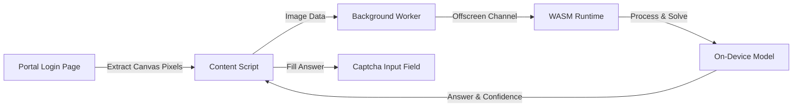

  
  <h1>AIUB Portal Captcha Auto-Solver</h1>
  
<strong>On-device neural network captcha solver for the AIUB Student Portal.</strong>

  

    
    
    
    
    
  

  

    
    
  

---

## Overview

### The Problem
Logging into the AIUB student portal ([portal.aiub.edu](https://portal.aiub.edu)) requires students to solve a distorted arithmetic captcha (such as `76 - 42 = ?`) on every login attempt. For students checking schedules, grades, and attendance throughout the day, deciphering noisy numbers and doing manual math creates repetitive friction and unnecessary login delays.

### The Solution
**AIUB Captcha Auto-Solver** automates the math captcha directly inside the browser. It reads the captcha canvas, predicts the equation using an on-device neural network, and fills the solution into the answer field in milliseconds.

> [!NOTE]
> The extension only reads the captcha image and fills the math result. It **never** reads, stores, or transmits Student IDs or passwords.

### Features

- **On-Device Solving:** Extracts the captcha directly from the canvas element, evaluates the arithmetic equation, and fills the answer field.
- **Zero Credential Access:** The extension never inspects or logs user credentials. You type your ID and password yourself.
- **Automatic Reroll:** Automatically clicks refresh for an easier captcha if recognition confidence is low (up to 5 attempts).
- **Optional Auto-Submit:** An opt-in toggle to click Login once credentials are typed, protected by a rolling rate cap to avoid account lockouts.
- **Status Indicator:** On-page badge showing solving state, alongside a popup for settings.
- **No External Servers:** Completely offline operation with no telemetry, third-party analytics, or external API dependencies.

---

## User Guide: Using on portal.aiub.edu

Once installed, the extension works automatically on the portal:

1. **Open the Portal:** Go to [portal.aiub.edu](https://portal.aiub.edu).
2. **Enter Student ID:** Type your Student ID into the username box and click outside (or press Tab). The portal will display the math captcha image.
3. **Automatic Solve:** The extension instantly reads the captcha, solves the arithmetic expression, and fills the answer into the box. An on-page status badge will indicate `Solved`.
4. **Log In:** Type your password and click **Log In**.
5. **Optional One-Click Login:** Click the extension icon in your browser toolbar to open the popup and enable **"Also click submit"**. When enabled, the extension will automatically click Log In after filling the captcha once both your ID and password fields are filled.

---

## Tech Stack & Architecture

| Component | Technology | Description |
|---|---|---|
| Extension Standard | Manifest V3 (MV3) | Supported across Chromium and Firefox |
| Execution Runtime | ONNX Runtime Web | WebAssembly SIMD execution provider |
| Image Processing | HTML5 Canvas Pipeline | Client-side pixel parsing and normalization |
| Chromium Worker | `chrome.offscreen` API | Isolated WebAssembly execution without blocking the main page |
| Firefox Worker | Background Event Scripts | Native background inference without requiring offscreen documents |

---

## How It Works

1. **Detection:** When the portal renders the captcha, the content script extracts the pixel data directly from the DOM image element.
2. **Preprocessing:** The image is normalized for local evaluation.
3. **Inference:** The on-device engine resolves the arithmetic expression inside the browser.
4. **Resolution:** The calculated solution is automatically typed into the captcha input box.
5. **Confidence Gating:** If the prediction confidence falls below 0.90, the extension clicks the refresh control for a new image instead of submitting an uncertain answer.

---

## Installation

1. Download the latest release from [Releases](https://github.com/jaeef/aiub-captcha-solver-extension/releases):
   - `aiub-captcha-solver-chrome.zip` (for Chrome, Edge, Brave, Opera)
   - `aiub-captcha-solver-firefox.zip` (for Firefox)
2. Extract the archive to a local folder.
3. **Chromium (Chrome, Edge, Brave):**
   - Open `chrome://extensions` and enable **Developer mode**.
   - Click **Load unpacked** and select the extracted folder.
4. **Firefox:**
   - Open `about:debugging#/runtime/this-firefox`.
   - Click **Load Temporary Add-on** and select `manifest.json` from the extracted folder.

---

## Privacy Policy

- **No Remote Servers:** The extension does not connect to any external server or API.
- **No Credential Access:** Passwords and usernames are never read, stored, or transmitted.
- **Local Storage Only:** Local browser storage is used exclusively to save toggle preferences and rate-limit counters.
- **No Telemetry:** No analytics, tracking scripts, or error loggers are included.

---

## License

Copyright (c) 2026 Jaeef. All rights reserved.

---

## Disclaimer

This project is an independent tool built for convenience when logging into your own AIUB account. Use responsibly in accordance with the portal's terms of service.
